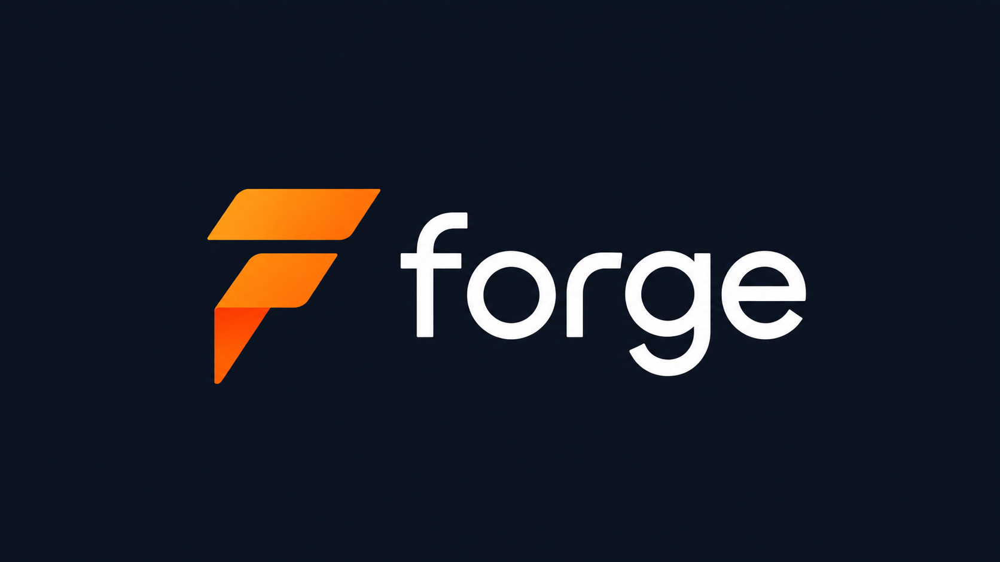
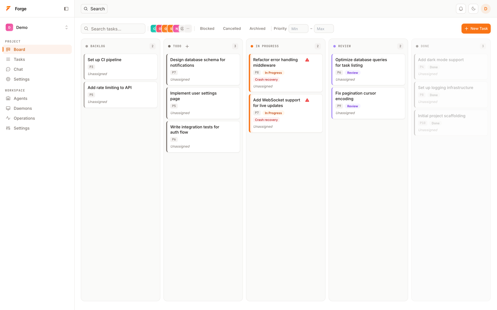
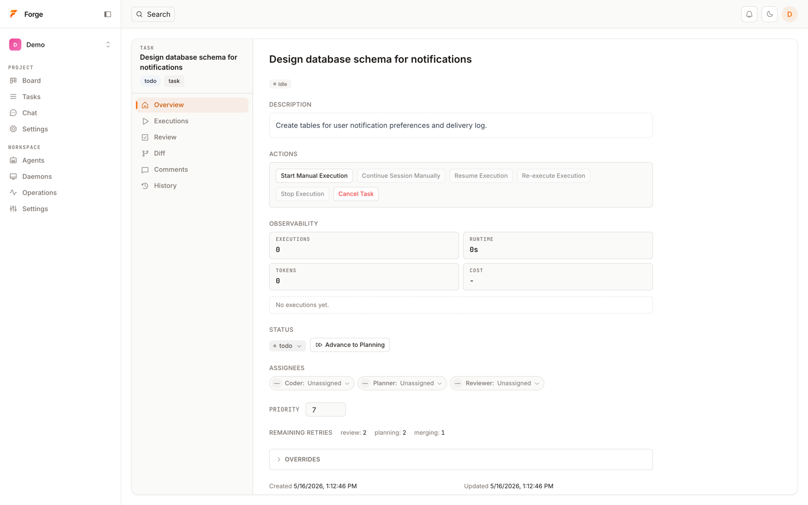
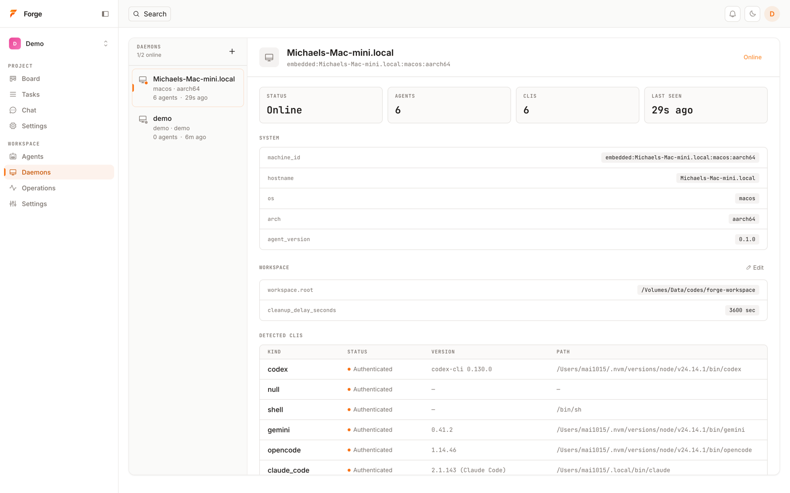

<div align="center">

<picture>
  <source media="(prefers-color-scheme: dark)" srcset="assets/forge-wordmark-transparent.png">
  
</picture>

**Make multiple coding agents collaborate on one repo — without stepping on each other.**

[](https://github.com/ForgeAILab/forge/actions/workflows/ci.yml)
[](https://github.com/ForgeAILab/forge/releases)
[](https://www.npmjs.com/package/@forgeailab/forge)
[](LICENSE)
[](#status)

Forge gives every task its own isolated git worktree, then runs your CI gate and
review step before changes touch `main`. Drive Claude Code, Codex, Gemini, opencode,
and your own shell agents through one local-first task lifecycle — REST API, MCP
endpoint, CLI, and web UI in a single binary. Self-hosted, MIT, no cloud.

[Quickstart](#5-minute-quickstart) · [Why Forge](#why-forge) · [Docs](docs/) · [Changelog](CHANGELOG.md) · [Contributing](CONTRIBUTING.md)

</div>

---

## Why Forge

Running two coding agents against the same repo is how you lose diffs. Forge fixes
that: every task runs in its own git worktree, hits your CI gate, and waits for
review before it merges. **Agents collaborate; they don't collide.**

- **One isolated git worktree per task** — Claude Code, Codex, and Gemini can each work in parallel without overwriting each other or polluting your main checkout.
- **Review gate with your CI** — define `ci_steps` per task; the review runner blocks merge until they pass. Human approval is an explicit transition, not an afterthought.
- **Structured task lifecycle** — `todo → in_progress → review → merging → done`, with an audit log and explicit cancellation paths so handoffs between agents (and humans) are legible.
- **BYO agent** — first-class adapters for Claude Code, Codex, Gemini, opencode, and a generic shell executor. Add your own with a small adapter.
- **One binary, every surface** — REST API, MCP JSON-RPC, `forge-ctl` CLI, and a React web UI ship together. Drive Forge from a script, an editor, or a browser.
- **Local-first by default** — single binary, SQLite, loopback-only server with a persisted local port. No telemetry, no SaaS, your data stays on disk.

## Who it's for

- **Developers already running more than one coding agent** (Claude Code + Codex, Codex + Gemini, …) who keep losing diffs to branch collisions or shared-tree edits.
- **Small engineering teams** piloting agent workflows who need worktree isolation, audit trails, and a review gate before code lands on `main`.
- **Builders** who want a local, hackable control plane for AI coding work — not another hosted dashboard.

If you only want a chat UI bolted onto your editor, Forge is not for you. Try Continue or Cline instead.

## 5-minute quickstart

```bash
# Run instantly through npm (macOS / Linux)
npx @forgeailab/forge --demo

# Install via Homebrew (macOS / Linux)
brew install forgeailab/tap/forge

# Or grab the latest release directly
curl -fsSL https://raw.githubusercontent.com/ForgeAILab/forge/main/install.sh | bash

# Start the server with seeded demo data if you installed it locally
forge --demo
```

Open the `management_url` printed in the server logs. That's it — you should
see a demo project with a labelled task and a fake daemon report. From here:

- Drive a real task end-to-end → [docs/getting-started.md](docs/getting-started.md)
- Wire up Claude Code / Codex / Gemini → [docs/getting-started.md#agents](docs/getting-started.md#configuring-agents)
- Hit the API directly → [docs/api.md](docs/api.md)

Prefer to build from source? `cargo run -p forge-cli -- --demo`.

## Core concepts

<picture>
  
</picture>

| Concept | What it is |
|---|---|
| **Project** | A workspace grouping repos, tasks, agents, and a workflow definition. |
| **Repo** | A pointer to a local git checkout that tasks operate on. |
| **Task** | A unit of agent work with a state, optional CI steps, and an audit log. |
| **Agent** | A registered AI executor (Claude Code, Codex, shell, …) bound to a daemon. |
| **Daemon** | The local process that reports installed CLIs and runs executions. |
| **Worktree** | An isolated git checkout created per task, cleaned up on `done`/`cancelled`. |
| **Review gate** | The CI steps + optional human approval that block `review → merging`. |

<table>
  <tr>
    <td width="50%"></td>
    <td width="50%"></td>
  </tr>
  <tr>
    <td><sub><em>Task detail — lifecycle, role assignments, CI/review gate, audit log</em></sub></td>
    <td><sub><em>Daemon — auto-detects installed CLIs on the host (Claude Code, Codex, Gemini, opencode, shell)</em></sub></td>
  </tr>
</table>

Deeper dive → [docs/architecture.md](docs/architecture.md).

## Documentation

| Doc | What's in it |
|---|---|
| [Getting started](docs/getting-started.md) | Install, first project, agents, end-to-end task walkthrough. |
| [Architecture](docs/architecture.md) | Crate graph, task state machine, database, event bus. |
| [API reference](docs/api.md) | REST endpoints, query params, pagination, MCP tools, SSE. |
| [forge-ctl CLI](docs/cli.md) | Subcommands, daemon link, scripted runs. |
| [Execution logs](docs/execution-logs.md) | JSONL log schema and chat-history reconstruction. |
| [Changelog](CHANGELOG.md) | Per-release changes and breaking notes. |

## Status

Forge is in **public beta** (`0.1.x`). The local-first single-user product is usable
end-to-end, but APIs, schemas, and CLI flags can change without deprecation cycles.
Track breaking changes in [CHANGELOG.md](CHANGELOG.md). A stable `1.0` will land
once the workflow engine, multi-user story, and release artifacts (signing, SBOMs,
Homebrew, Windows builds) are finalized.

## Contributing

Issues, PRs, and design discussion are welcome. Start with [CONTRIBUTING.md](CONTRIBUTING.md)
and check `good first issue` and `help wanted` labels. By participating you agree to
the [Code of Conduct](CODE_OF_CONDUCT.md).

## Security

Please report vulnerabilities privately per [.github/SECURITY.md](.github/SECURITY.md).

## License

[MIT](LICENSE) © Forge contributors.
